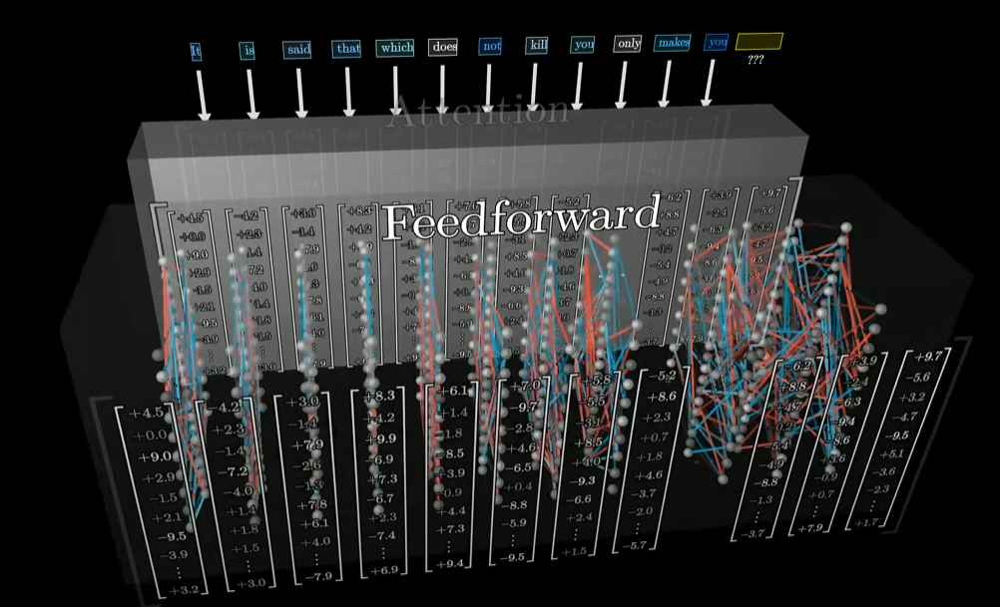
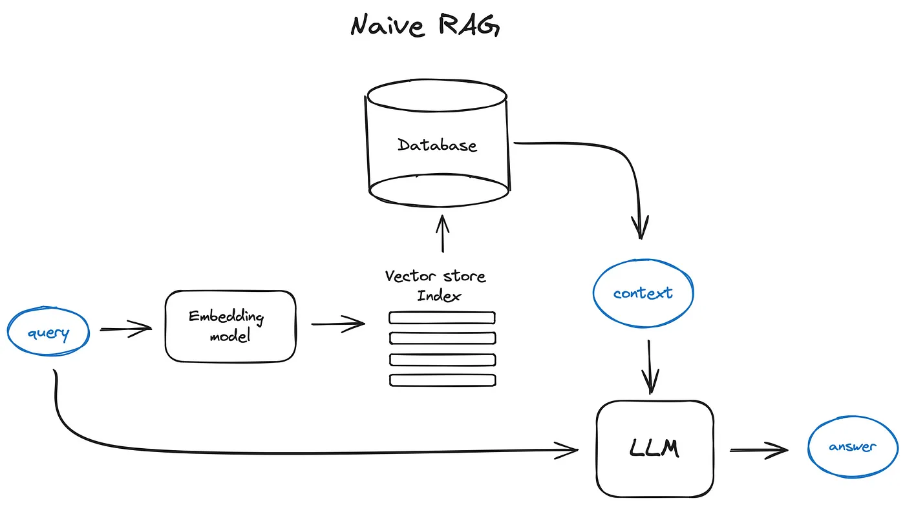

## Ep02: 深入理解 LLM 工具的基础知识

在本节中，我们将以更深刻的视角探讨大型语言模型（Large Language Model, LLM）的基础知识及其在游戏策划中的应用潜力。通过对核心概念与实际案例的分析，我们旨在为研究生或专业开发者提供有理论深度的实用指南。

---

#### 一、LLM 的基本理论概述

LLM（大型语言模型）指的是基于深度学习技术训练的大规模自然语言处理模型，其核心在于通过学习海量的文本语料，掌握语言的语法、语义及上下文关联能力。这些模型以神经网络架构为基础，例如 Transformer，其显著特征是高度的自注意力机制，使得模型能够有效捕捉长距离的语言依赖关系。

一个典型的 LLM，如 OpenAI 的 GPT 系列，不仅能够生成自然流畅的文本，还能处理复杂的逻辑推理任务。例如，在设计一款叙事驱动型游戏时，LLM 可以用来自动生成角色对白、背景故事，甚至任务线索，为开发者提供更高的生产力和创意支持。

>扩展阅读：
>[https://www.youtube.com/watch?v=LPZh9BOjkQs](https://www.youtube.com/watch?v=LPZh9BOjkQs)
>B站转载：[https://www.bilibili.com/video/BV1Ve6JYXEtu/](https://www.bilibili.com/video/BV1Ve6JYXEtu/)
---

#### 二、RAG 和 Agent 增幅 LLM

在 LLM 的相关生态中，RAG（Retrieval-Augmented Generation）与智能代理（Agent）代表了两种重要的技术路径：

1. **RAG：融合检索与生成**

   RAG 的核心在于将传统的信息检索技术与语言生成模型相结合。具体而言，RAG 通过先从外部知识库中检索相关数据，再结合 LLM 生成更精准且上下文相关的内容。其实现依赖于双向编码器表示（BERT）等检索模型与生成模型的协同。

   

   在实际应用中，例如设计一个具有历史背景的游戏关卡，RAG 系统可以从历史文献中提取相关细节，并生成符合语境的场景描述或任务设定。

   >扩展阅读：[Advanced RAG Techniques: an Illustrated Overview](https://baoyu.io/translations/rag/advanced-rag-techniques-an-illustrated-overview)

2. **Agent 智能代理：面向任务的执行系统**

   智能代理是一种能够自主执行任务的系统，其本质是一种强化学习或规划算法与语言模型的集成。它能够理解复杂的指令并动态适应环境变化。例如，在开发复杂的开放世界游戏时，智能代理可以用来生成动态剧情分支，甚至实时调整游戏内 NPC 的行为逻辑。

   

   >
   扩展阅读：[LLM Powered Autonomous Agents](https://lilianweng.github.io/posts/2023-06-23-agent/)

---

#### 三、游戏策划中 LLM 的深度应用场景

LLM 在游戏策划中的应用不仅局限于文本生成，其潜力更体现在以下几个方面：

1. **世界观与角色设定的自动化**
   使用 LLM，可以快速生成符合逻辑且富有创意的角色背景。例如，模型可以生成一个多维度的角色画像，包括其历史、性格与行为动机，甚至细化到语言习惯和社会网络。这种生成过程能够显著减少开发者在策划阶段的重复劳动。

2. **复杂任务链与分支剧情的设计**
   在任务设计中，LLM 能够生成连贯的剧情链条，同时考虑玩家选择对后续情节的影响。例如，模型可以预测不同选择的潜在后果，并生成相应的情节文本，从而提升游戏的沉浸感和交互性。

3. **游戏机制优化与关卡奖励生成**
   借助 RAG 或 Agent 的辅助，开发者可以设计更加复杂的关卡挑战与奖励机制。例如，一个动态生成的奖励系统可以根据玩家的行为习惯，实时调整奖励类型与难度。

---

#### 四、工具的选择与部署优化

根据不同的需求，研究者和开发者可以选择商用工具或开源框架：

- **商用工具**：OpenAI 的 GPT 系列与阿里的通义千问适合快速实现概念验证。这些工具具有强大的自然语言理解与生成能力，同时提供丰富的 API 接口。

- **开源工具**：如 Anything LLM 和 LM Studio。这类工具在模型自定义与本地部署上具有显著优势，适合需要高度灵活性和隐私保护的场景。此外，结合高性能硬件，可以通过量化技术减少模型运行时的资源占用。

---

#### 五、未来发展趋势与研究方向

从长远看，LLM 在游戏开发中的应用仍有广阔空间。未来的研究方向可能包括：

1. **实时生成技术**
   探索如何在高互动性场景中实现实时内容生成。例如，动态叙事系统可以通过实时分析玩家行为，调整剧情推进方式。

2. **多模态模型集成**
   结合视觉、音频等多模态输入，开发更加智能化的 NPC 系统或场景生成工具。

3. **跨学科应用**
   将语言模型与心理学、行为学结合，以生成更贴合玩家心理的交互内容。

---

#### 六、总结与展望

本节通过系统地介绍 LLM 的理论与应用，强调了其在游戏策划中的变革性潜力。从核心概念到技术实现，再到未来发展方向，希望为读者提供清晰的研究思路与实践路径。

下一节课程将详细讲解商用 LLM 工具的具体操作方法，并通过实例分析其实际应用效果。敬请期待！

---

> 参考资料：
>
> * 
> * [https://github.com/datawhalechina/agent-tutorial/blob/main/docs/%E7%AC%AC%E4%B8%80%E7%AB%A0%EF%BC%9AAgent%E7%AE%80%E4%BB%8B/1.1%20Agent%E5%8E%9F%E7%90%86.md](https://github.com/datawhalechina/agent-tutorial/blob/main/docs/%E7%AC%AC%E4%B8%80%E7%AB%A0%EF%BC%9AAgent%E7%AE%80%E4%BB%8B/1.1%20Agent%E5%8E%9F%E7%90%86.md)
> * [https://baoyu.io/translations/rag/advanced-rag-techniques-an-illustrated-overview](https://baoyu.io/translations/rag/advanced-rag-techniques-an-illustrated-overview)
>