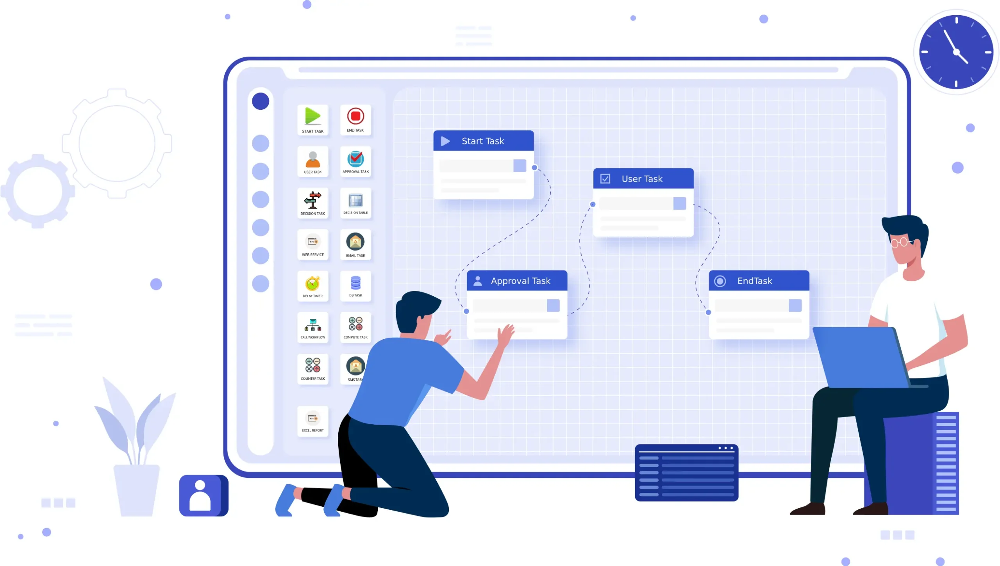

# ep04 - 智能工作流 (AI Workflow)

## 1. 概念

实际上， 不论智能体 Agent 还是 AI Workflow，都是用来创作 AI 应用的工具。

只不过，理想中的 Agent 概念,只需要一句话，就会全自动规划，然后执行相应的任务。不过现阶段根本做不到

这就需要 AI Workflow ，由人来规划个步骤具体流程，实际的Agent 也可以在流程中充当一个节点，最终来准确实现既定任务。

### 1.1 智能工作流

AI Workflow = Workflow + AI Node(Agent 等)

- **定义**：智能工作流（AI Workflow）是指将 AI 技术与自动化工具相结合，通过高效的资源调度和数据处理，完成复杂任务的流程。
- **核心特点**：
  - 预先编程：通过工作流编排工具，定义任务执行顺序并管理依赖关系，确保任务按照设定好的流程运行。
  - 智能决策：依赖 AI 模型进行高效优化。可以将 AI Agent 作为节点，在流程中嵌入，实现智能决策。
- **实现方式**：
  - 流程编排工具：通过工具如 n8n 或 Prefect，定义任务执行顺序并管理依赖关系，确保任务按时完成。
  - AI 模型集成：结合 NLP（自然语言处理）和 CV（计算机视觉）技术，将智能化决策融入流程。
  - 数据处理模块：使用实时分析和预处理工具优化数据流，为动态调整提供支持。
  - 任务自动化：通过 RPA 工具（如 UiPath），完成高效的重复性工作以提升整体效率。

### 1.2 AI Workflow 应用场景

AI Workflow 和 智能体一样，正处在高速发展演进过程中，数十上百个软件在近两年内冒出，各有特色，应用场景已经覆盖各个产业。

下面列出一些较为常见的应用场景，：

- **商业应用**：
  - 客服自动化：如智能客服与客户支持。
  - 市场分析：数据驱动的消费者行为预测。
- **工业应用**：
  - 智能制造：从生产排程到质量控制的全链条智能化。
  - 智能物流：仓储自动化与运输路径优化。
- **游戏开发**：
  - 素材生成：如角色设计、地图布局。
  - 测试优化：自动化错误检测与平衡性调整。
- **等等......**

**总结**：实际上，现阶段，只要是能够 **流程化** 创建 AI 应用的工具，都可以归为 AI Workflow 的范畴。

### 1.3 与智能体的区别

- **智能工作流**：
  - 多步任务的执行与调度。
  - 目标明确且流程固定。
  - 精确性高，但缺乏灵活性，基本上不会有自行发挥的能力。类似LLM模型中，温度值设置为较低的效果
- **智能体**：
  - 独立个体，具有感知、决策和行动能力。
  - 能够动态应对非结构化环境的变化。
  - 精确性较低，但更加灵活，且富有创造性。类似LLM模型中，温度值设置为较高的效果

## 2. 如何创建 AI Workflow

### 2.1 国内外商用软件

- **国内代表**：
  - 字节"扣子": 基于 doubao 大模型和火山方舟平台，涵盖智能体/智能工作流/ai应用开发等各项功能
  - 百度智能云工作流：基于飞桨生态，支持 NLP 与 CV 应用。
  - 阿里云 AI 工作流：提供面向企业的自动化服务。
- **国外代表**：
  - Microsoft Power Automate：用于低代码流程自动化。
  - Zapier：它可以帮助用户将不同的应用和服务链接起来，从而自动执行任务。虽然本身不是专门针对AI的工作流工具，但它可以与许多AI服务进行集成，以创建智能化的工作流。
  - UiPath：专注于 RPA 和智能流程自动化。

### 2.2 开源软件

根据最新的 GitHub 数据，以下是部分排名较靠前的开源 AI 工作流项目（如有错漏，请私信我，我会及时更新）：

| 项目名称           | 描述                                                                                      | GitHub 地址                                                                      | Star 数 |
| ------------------ | ----------------------------------------------------------------------------------------- | -------------------------------------------------------------------------------- | ------- |
| **n8n**            | 开源的工作流自动化平台，具有原生 AI 功能，支持可视化构建和自定义代码，提供 400 多种集成。 | [https://github.com/n8n-io/n8n](https://github.com/n8n-io/n8n)                   | 55.7k   |
| **Apache Airflow** | 一个平台，用于以编程方式创建、调度和监控工作流。                                          | [https://github.com/apache/airflow](https://github.com/apache/airflow)           | 38.4k   |
| **Flowise**        | 拖放界面构建定制化的LLM流程，简单易用                                                     | [https://github.com/FlowiseAI/Flowise](https://github.com/FlowiseAI/Flowise)     | 34.2k   |
| **Prefect**        | 一个用于在 Python 中构建弹性数据管道的工作流编排框架。                                    | [https://github.com/PrefectHQ/prefect](https://github.com/PrefectHQ/prefect)     | 18.1k   |
| **Temporal**       | 一个分布式的、可扩展的、持久化的工作流管理系统。                                          | [https://github.com/temporalio/temporal](https://github.com/temporalio/temporal) | 12.7k   |
| **Metaflow**       | Netflix 开源的用于构建和管理真实世界数据科学项目的框架。                                  | [https://github.com/Netflix/metaflow](https://github.com/Netflix/metaflow)       | 8.5k    |

- 请注意，Star 数可能会随着时间变化，以上数据截至 2025 年 1 月 21 日。

## 3. AI Workflow 在游戏开发中的应用

### 3.1 策划阶段

- **剧情生成**：利用 LLM 为游戏编写故事和角色背景。
- **任务逻辑设计**：动态生成任务分支与奖励系统。
- **世界观构建**：整合生成内容，优化叙事结构。

### 3.2 开发阶段

- **素材生成**：
  - 使用 AI 生成 2D 像素角色和背景。
  - 自动创建技能特效和音效。
- **代码开发**：
  - 利用 Copilot 辅助代码生成。
  - 基于 AI 的自动化测试脚本生成。

### 3.3 测试与优化

- **错误检测**：AI 自动捕捉代码缺陷和运行异常。
- **性能调优**：利用智能工具优化加载时间与内存管理。

### 3.4 发布与运营

- **市场预测**：AI 分析玩家行为，预测市场趋势。
- **内容更新**：基于玩家反馈自动生成新内容。

## 4. 国内AI应用开发工具

数据信息截至2025-1-21，仅包含一些我所知的常用工具，如有更好的建议，请私信我更新

| 平台名称                      | 公司     | 用户数（估计，万） | 优点                                                                                             | 缺点                                     | 特色功能                                       | 官方网站                                                           |
| ----------------------------- | -------- | ------------------ | ------------------------------------------------------------------------------------------------ | ---------------------------------------- | ---------------------------------------------- | ------------------------------------------------------------------ |
| **百度智能云千帆 AppBuilder** | 百度     | 2000               | 集成百度大模型与 AI 能力，提供可视化应用编排操作台，支持多模态处理和多轮对话编排，输出稳定可控。 | 对开发者的技术水平有一定要求。           | 可视化操作台，支持多轮对话编排。               | [千帆 AppBuilder](https://cloud.baidu.com/product/appbuilder.html) |
| **腾讯元器**                  | 腾讯     | 1500               | 无缝集成微信、QQ 等社交平台，支持插件化开发，方便用户使用。                                      | 依赖腾讯生态，可能对第三方平台支持较弱。 | 智能体轻松发布到社交平台。                     | [腾讯元器](https://open.tencent.com/)                              |
| **扣子（Coze）**              | 字节跳动 | 200                | 支持可视化流程创建，操作简单，门槛低，适合中小企业或开发团队。                                   | 功能相对轻量，适合小型到中型项目。       | 高效的拖拽式工作流工具，快速构建智能应用。     | [扣子 Coze](https://coze.cn/)                                      |
| **FastGPT**                   | 开源社区 | 100                | 开源，支持本地部署，保证私有数据安全，专注知识库问答和数据处理。                                 | 界面较简陋，对小型团队需要较多配置工作。 | 提供知识库构建，支持数据预处理和问答流程优化。 | [FastGPT](https://fastgpt.run/)                                    |
| **Dify**                      | 开源社区 | 50                 | 开源，支持自定义 RAG 检索，灵活性高，适合开发者创建高效、安全且可扩展的 AI 应用。                | 部分功能对技术小白不够友好。             | 专注生成式 AI 与自定义功能，提供多种开发工具。 | [Dify](https://dify.ai/)                                           |

> 参考资料：
>
> - [扣子文档](https://www.volcengine.com/docs/84458/1288962)
